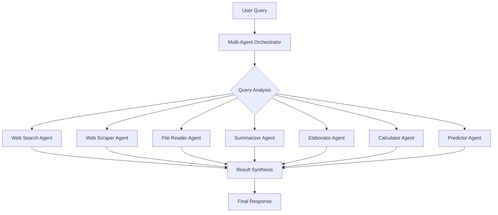

# 🤖 Multi-Agent AI Assistant with LangGraph

A sophisticated Streamlit application showcasing the power of **LangGraph** framework for orchestrating multiple specialized AI agents. This application demonstrates how LangGraph enables seamless coordination of different AI capabilities through graph-based workflows, providing intelligent routing, state management, and dynamic agent collaboration.

## 🚀 What is LangGraph and Why Use It?

**LangGraph** is a revolutionary framework for building stateful, multi-actor applications with large language models (LLMs). It extends LangChain's capabilities by introducing graph-based orchestration, making it the ideal choice for complex AI workflows.

### 🎯 Key Benefits of LangGraph:

1. **Graph-Based Architecture**: Define workflows as directed graphs where nodes are agents/functions and edges represent flow of execution
2. **State Management**: Built-in state persistence across multiple agent interactions
3. **Dynamic Routing**: Intelligent decision-making on which agents to activate based on query analysis
4. **Parallel Execution**: Support for concurrent agent processing to reduce response time
5. **Error Handling**: Robust error recovery and fallback mechanisms
6. **Extensibility**: Easy to add new agents or modify existing workflows
7. **Production Ready**: Designed for enterprise-scale applications with monitoring and observability

### 🔄 How This Application Uses LangGraph:

This application implements a **Multi-Agent Orchestrator** using LangGraph that:
- **Analyzes** incoming queries to determine appropriate agents
- **Routes** requests to relevant specialized agents
- **Manages** state across agent interactions
- **Synthesizes** results from multiple agents into coherent responses
- **Handles** errors gracefully with fallback strategies

## 🏗️ Application Architecture

### 📊 LangGraph Workflow Implementation

The application uses LangGraph to create a sophisticated multi-agent system with the following architecture:



### 🎯 Intelligent Agent Routing

The LangGraph orchestrator implements sophisticated query analysis to determine which agents to activate:

1. **Keyword Detection**: Scans for specific keywords and patterns
2. **Context Analysis**: Considers uploaded files and URLs
3. **Intent Classification**: Determines user intent (search, calculate, analyze, etc.)
4. **Multi-Agent Coordination**: Can activate multiple agents for complex queries
5. **Dynamic Fallbacks**: Uses elaborator agent as default for unclear queries

### 🔧 Core Components

#### 1. **Multi-Agent Graph** (`graph/multi_agent_graph.py`)
- **StateGraph**: Manages application state using LangGraph's StateGraph
- **Node Functions**: Each agent is a node in the graph
- **Edge Definitions**: Controls flow between agents
- **State Management**: Maintains context across agent executions

#### 2. **Specialized Agents** (`agents/`)
Each agent is a specialized component with specific capabilities:
- **Web Search Agent**: DuckDuckGo integration for real-time information
- **Web Scraper Agent**: Beautiful Soup for content extraction
- **File Reader Agent**: Multi-format file processing (PDF, DOCX, CSV, JSON, TXT)
- **Summarizer Agent**: Content compression and key point extraction
- **Elaborator Agent**: Detailed explanations and content expansion
- **Calculator Agent**: Mathematical computations and statistical analysis
- **Predictor Agent**: Trend analysis and data prediction

#### 3. **State Management**
```python
class MultiAgentState(TypedDict):
    query: str              # User's original query
    context: str           # Accumulated context
    results: Dict[str, Any] # Results from each agent
    active_agents: List[str] # Currently active agents
    final_response: str    # Synthesized response
    uploaded_files: List   # File attachments
    urls: List[str]        # Web URLs for processing
    data: Any             # Structured data
```

## 🎨 Features

### 🤖 AI-Powered Agents
- **🔍 Web Search Agent**: Real-time web searching with DuckDuckGo integration
- **🕷️ Web Scraping Agent**: Intelligent content extraction from web pages
- **📄 File Reader Agent**: Multi-format file processing (PDF, DOCX, CSV, JSON, TXT)
- **📝 Summarization Agent**: Advanced text summarization with key insight extraction
- **📖 Elaboration Agent**: Detailed explanations and comprehensive content expansion
- **🧮 Calculator Agent**: Mathematical computations with statistical analysis capabilities
- **📈 Prediction Agent**: Data trend analysis and predictive modeling

### 🔧 Technical Infrastructure
- **LangGraph Orchestration**: Graph-based workflow management for intelligent agent coordination
- **Azure OpenAI GPT-4o**: Enterprise-grade language model for all LLM operations
- **FAISS Vector Store**: High-performance similarity search and document retrieval
- **Streamlit Interface**: Modern, responsive web UI with real-time interactions
- **State Management**: Persistent conversation context and multi-turn interactions
- **Error Handling**: Robust fallback mechanisms and graceful degradation

### 🎯 Smart Features
- **Dynamic Agent Selection**: Automatically chooses relevant agents based on query analysis
- **Multi-Agent Collaboration**: Combines results from multiple agents for comprehensive responses
- **Context Awareness**: Maintains conversation history and file/URL context
- **Real-time Processing**: Live status updates and streaming responses
- **Analytics Dashboard**: Usage metrics and conversation analytics
- **Export Functionality**: Download conversations and results in multiple formats

## 🚀 Quick Start Guide

### Prerequisites
- Python 3.8 or higher
- Azure OpenAI API access
- Internet connection for web search capabilities

### Installation Steps

1. **Clone or Navigate to the Repository**
   ```bash
   cd "c:\Users\a.cb.srivastava\OneDrive - Data&AI Team\Langgraph"
   ```

2. **Set Up Python Environment** (Recommended)
   ```bash
   python -m venv .venv
   .venv\Scripts\activate  # On Windows
   # or
   source .venv/bin/activate  # On Linux/Mac
   ```

3. **Install Dependencies**
   ```bash
   pip install -r requirements.txt
   ```

4. **Configure Environment Variables**
   
   Create a `.env` file in the root directory:
   ```env
   # Azure OpenAI Configuration
   OPENAI_API_TYPE=azure
   OPENAI_API_VERSION=2023-03-15-preview
   AZURE_OPENAI_ENDPOINT=https://your-azure-endpoint.openai.azure.com
   OPENAI_API_KEY=your-azure-api-key
   
   # Optional Configuration
   EMBEDDING_MODEL=sentence-transformers/all-MiniLM-L6-v2
   MAX_SEARCH_RESULTS=5
   VECTOR_STORE_PATH=./vector_store
   ```

5. **Launch the Application**
   ```bash
   streamlit run app.py
   ```

6. **Access the Interface**
   - Open your browser to `http://localhost:8501`
   - Start interacting with the multi-agent system!

### Quick Automation Scripts

For Windows users, use the provided batch files:
```bash
# Install dependencies
install.bat

# Start the application
start.bat
```

## 📁 Project Structure

```
langgraph/
├── 📱 app.py                    # Main Streamlit application with UI components
├── 📋 requirements.txt          # Python dependencies
├── 🔧 .env.example             # Environment variables template
├── 🚀 install.bat              # Windows installation script
├── ▶️ start.bat                # Windows startup script
├── 📖 COMPLETE_TEST_GUIDE.md    # Comprehensive testing guide
│
├── 🤖 agents/                   # Specialized AI Agents
│   ├── __init__.py
│   ├── 🔍 web_search.py        # Web search with DuckDuckGo
│   ├── 🕷️ web_scraper.py       # Web content extraction
│   ├── 📄 file_reader.py       # Multi-format file processing
│   ├── 📝 summarizer.py        # Text summarization
│   ├── 📖 elaborator.py        # Content elaboration
│   ├── 🧮 calculator.py        # Mathematical computations
│   └── 📈 predictor.py         # Data analysis and prediction
│
├── 🕸️ graph/                   # LangGraph Workflow Management
│   ├── __init__.py
│   └── 🎯 multi_agent_graph.py # Core orchestrator with state management
│
├── ⚙️ config/                  # Configuration Management
│   ├── __init__.py
│   ├── 🛠️ settings.py          # Application settings and agent prompts
│   └── 📊 vector_store/        # Vector store configurations
│
├── 🔧 utils/                   # Utility Components
│   ├── __init__.py
│   ├── 🧠 models.py            # Azure OpenAI model management
│   ├── 📊 vector_store.py      # FAISS vector store operations
│   └── 🔤 embeddings.py        # Embedding model utilities
│
├── 📁 vector_store/            # FAISS Index Storage
│   ├── 🗂️ faiss_index          # Vector similarity search index
│   └── 📋 metadata            # Document metadata
│
└── 📄 sample_files/            # Test Documents
    ├── sample_ai_report.txt
    ├── sample_financial_data.csv
    ├── sample_document.txt
    └── sample_healthcare_ai_report.pdf
```

## Use Cases

### 🔍 **Research & Information Gathering**
- **Academic Research**: Find latest papers, analyze research trends, summarize findings
- **Market Research**: Gather competitor information, market analysis, industry trends
- **News Analysis**: Track current events, analyze news sentiment, create briefings
- **Due Diligence**: Research companies, analyze financial data, assess business risks

### 📊 **Data Analysis & Business Intelligence**
- **Financial Analysis**: Calculate ratios, analyze trends, predict market movements
- **Sales Reporting**: Summarize sales data, identify patterns, forecast revenue
- **Performance Metrics**: Analyze KPIs, create executive summaries, track goals
- **Customer Analytics**: Process feedback, analyze satisfaction scores, predict churn

### 📚 **Content Creation & Documentation**
- **Technical Writing**: Create documentation, explain complex concepts, write guides
- **Report Generation**: Summarize meetings, create status reports, compile findings
- **Educational Content**: Develop training materials, create learning resources
- **Marketing Content**: Generate articles, analyze competitor content, create briefs

### 🏢 **Enterprise Applications**
- **Knowledge Management**: Process internal documents, create knowledge bases
- **Compliance Reporting**: Analyze regulations, generate compliance reports
- **Strategic Planning**: Analyze market data, create strategic recommendations
- **Risk Assessment**: Evaluate risks, analyze scenarios, create mitigation plans

### 🔬 **Scientific & Technical Applications**
- **Literature Review**: Analyze research papers, identify knowledge gaps
- **Data Processing**: Clean and analyze datasets, generate insights
- **Technical Analysis**: Explain complex systems, create technical documentation
- **Innovation Research**: Track emerging technologies, analyze patent data

### 💼 **Personal Productivity**
- **Meeting Summaries**: Transcribe and summarize meetings, extract action items
- **Learning Assistant**: Explain complex topics, create study materials
- **Travel Planning**: Research destinations, analyze costs, create itineraries
- **Investment Research**: Analyze stocks, track market trends, calculate returns

## Usage

1. Start the application: `streamlit run app.py`
2. Enter your query in the chat interface
3. The system will automatically determine which agents to use
4. View results with interactive visualizations
5. Access conversation history and document storage

## Scaling the Application

### 🚀 **Horizontal Scaling**
- **Microservices Architecture**: Deploy each agent as a separate service
- **Load Balancing**: Use nginx or cloud load balancers to distribute requests
- **Container Orchestration**: Deploy with Kubernetes for auto-scaling
- **Message Queues**: Implement Redis/RabbitMQ for asynchronous processing

### 📈 **Performance Optimization**
- **Caching Layer**: Implement Redis for vector store and API response caching
- **Database Integration**: Replace file-based storage with PostgreSQL/MongoDB
- **GPU Acceleration**: Deploy embedding models on GPU instances
- **CDN Integration**: Use CloudFlare/AWS CloudFront for static assets

### ☁️ **Cloud Deployment Options**
- **AWS**: ECS/EKS with RDS, ElastiCache, and S3
- **Azure**: Container Instances with Cosmos DB and Redis Cache
- **GCP**: Cloud Run with Cloud SQL and Memorystore
- **Kubernetes**: On-premises or cloud-managed Kubernetes clusters

### 📊 **Monitoring & Analytics**
- **Application Monitoring**: Implement Prometheus + Grafana
- **Log Management**: Use ELK Stack (Elasticsearch, Logstash, Kibana)
- **Error Tracking**: Integrate Sentry for error monitoring
- **Performance Metrics**: Track response times, agent usage, success rates

### 🔒 **Security & Compliance**
- **Authentication**: Implement OAuth2/SAML for enterprise SSO
- **API Security**: Add rate limiting, JWT tokens, API keys
- **Data Encryption**: Encrypt data at rest and in transit
- **Audit Logging**: Track all user interactions and data access

### 🌐 **Multi-Tenant Architecture**
- **Tenant Isolation**: Separate vector stores per organization
- **Resource Quotas**: Implement usage limits per tenant
- **Custom Configurations**: Allow tenant-specific agent settings
- **Billing Integration**: Track usage for cost allocation

## Configuration

- Configure Azure OpenAI GPT-4o in `utils/models.py`
- Adjust embedding model settings
- Customize agent behaviors and prompts

### Environment Variables
```bash
# .env file
OPENAI_API_TYPE=azure
OPENAI_API_VERSION=2023-03-15-preview
AZURE_OPENAI_ENDPOINT=https://<your-azure-endpoint>
OPENAI_API_KEY=<your-azure-api-key>
EMBEDDING_MODEL=sentence-transformers/all-MiniLM-L6-v2
MAX_SEARCH_RESULTS=5
VECTOR_STORE_PATH=./vector_store
```

### Web Search Issues
If you get "No search results found" errors:
1. The web search agent tries multiple methods (DuckDuckGo API + HTML search)
2. If web search fails, it falls back to LLM general knowledge
3. For better results, try rephrasing queries to include current event keywords


### Query Examples

#### 🔍 **Web Search Agent**
- "What is Tesla doing in India?"
- "Latest developments in artificial intelligence 2025"
- "Current status of renewable energy adoption"
- "Recent mergers and acquisitions in tech industry"

#### 🕷️ **Web Scraper Agent**
- "Extract content from https://example.com/article"
- "Scrape information from these URLs: [paste URLs]"
- "Get the main content from this webpage"

#### 📄 **File Reader Agent**
- Upload files and ask: "Analyze this financial data"
- "What are the key insights from this document?"
- "Summarize the main points from this report"
- "Find trends in this CSV data"

#### 📝 **Summarizer Agent**
- "Summarize this document in bullet points"
- "Create a brief overview of this content"
- "Give me the key takeaways from this text"
- "Provide an executive summary"

#### 📖 **Elaborator Agent**
- "Explain quantum computing in simple terms"
- "Write a comprehensive article about machine learning"
- "Elaborate on the benefits of renewable energy"
- "Provide detailed information about blockchain technology"

#### 🧮 **Calculator Agent**
- "Calculate 15% of 1200"
- "What's the average of 10, 20, 30, 40, 50?"
- "Find the compound interest on $10,000 at 5% for 3 years"
- "Calculate the standard deviation of: 2, 4, 6, 8, 10"

#### 📈 **Predictor Agent**
- "Analyze trends in this data: [1, 3, 5, 7, 9, 11]"
- "Predict future values based on this pattern"
- "What insights can you derive from this dataset?"
- "Forecast the next 3 values in this sequence"

### Sample Test Queries
Here are 5 comprehensive queries to test all agents:
1. **Multi-Agent Research**: "Research Tesla's market performance, calculate their growth rate, and predict future trends"
2. **Document Analysis**: "Analyze this financial report and summarize key findings" (with uploaded PDF)
3. **Current Events**: "What's happening with AI regulation globally and elaborate on the implications"
4. **Data Processing**: "Calculate statistics for this dataset and predict future patterns" (with uploaded CSV)
5. **Web Analysis**: "Scrape content from company websites and analyze their business strategies"

### Credits:
**Ashutosh Srivastava**